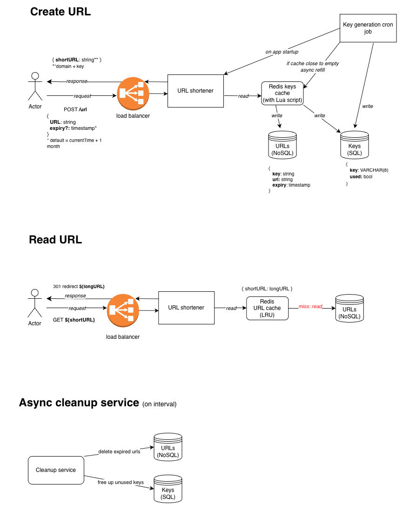

## URL Shortener - System Design Implementation

Implementation of a URL shortener built in Go to explore scaling techniques and meet demanding non-functional requirements.

### Non-Functional Requirements

- **Low-latency redirects**: ~200ms response time for URL lookups
- **High scale**: Designed to support millions of DAU and 1B URLs
- **Uniqueness**: Guaranteed unique short URL generation with no collisions
- **High availability**: Fault-tolerant architecture with horizontal scalability

### Architecture & Tech Stack



- **REST API Server**: Echo framework (`github.com/labstack/echo/v4`)
- **Primary Database**: PostgreSQL (`github.com/jackc/pgx/v5`) - URL and unique key storage
- **Cache Layers**: Redis (`github.com/redis/go-redis/v9`) - low-latency URL lookups and unique key distribution
- **Background Jobs**: Cron (`github.com/robfig/cron/v3`) - key generation and expired URL cleanup

### Key Design Decisions

#### Read-Optimised Caching
Read-through cache with LRU eviction for sub-200ms redirects on URL lookups

#### Database Schema
Two-table design:
- `keys` table: Tracks all generated keys and their usage status
- `urls` table: Stores short-to-long URL mappings with metadata

#### Pre-Generated Key Pool with Atomic Key Claiming
Short URLs use base62-encoded keys that are:
1. **Pre-generated in batches** on startup and via background cron job
2. **Checked for uniqueness** during generation and stored in a dedicated `keys` table
3. **Claimed atomically** from Redis keys cache using Lua scripts to prevent race conditions across multiple instances
4. **Recycled after expiration** to maximise key space utilisation

This approach eliminates collision checks during URL creation.

#### Health Checks
`/health` endpoint monitors:
- PostgreSQL connectivity
- Redis connectivity

Returns `200 OK` if all dependencies are healthy, `503 Service Unavailable` otherwise.

### Future Optimisations

#### Redis High Availability
Currently using a single Redis instance, which is a single point of failure. I am planning to use Redis Sentinel for automatic failover with a master-replica setup.

#### Additional Considerations
- API Gateway (e.g. AWS API Gateway) to handle rate-limiting, authentication and load balancing
- Vertically scaling primary server to handle more URL reads (slightly over-provisioned for writes but simpler and more cost effective than using separate read/write services)
- Shard by shortURL if URL table exceeds memory limit
- Read replicas for increased fault-tolerance 


## API

### Create short URL - POST /urls
Creates a new short URL from a provided long URL.
Accepts an optional expiry datetime.
Returns the shortened URL containing a unique key.

#### <u>Request</u>

Body schema
  ```
  {
    "url": "string",                          // Required. Full URL to shorten.
    "expiry*": "string (RFC3339 datetime)"    // Optional. Expiration datetime.
  }
  ```

Example
  ```
  {
    "url": "https://api.example.org/v1/users/profile/987654321/details/gb/all",
    "expiry*": "2025-11-08T02:40:25+00:00"
  }
  ```

#### <u>Response</u>

Body schema
  ```
  {
    "url": "string" // The generated short URL
  }
  ```

Example
  ```
  {
    "url": "https://${API_DOMAIN}/j1ll5xx8"
  }
  ```

### Resolve original URL - GET/{shortURL}
Retrieves and redirects to the original long URL using the short URL as a path parameter with status code 302.

#### <u>Request</u>

  `GET https://${API_DOMAIN}/j1ll5xx8`

## Development

### Setup

#### 1. Install dependencies:
```make dep```

#### 2. Set up environment files:
Create the following env files (you can use `.env.example` as a reference for the required variables):
- `.env` - your default local environment variables
- `.env.docker` - overrides for Docker (e.g. using @postgres as the DB host instead of localhost)
- `prod/.env` - production environment variables

### Run the app

#### 1. With docker:

`docker compose up -d`

#### 2. Without docker:

- Start the app:
`make start`

- Start databases (still run via docker):
`make start-dbs`

- Stop databases (still run via docker):
`make stop-dbs`

### Test

`make test`

### Lint
- Run linter:
`make lint`

- Fix issues:
`make lint-fix`

## Deployment

Before deploying, add the following secrets to your GitHub repository:

- `DOCKER_USER` – your Docker Hub username
- `DOCKER_PASSWORD` – your Docker Hub password

These secrets are required by the release workflow to push your application’s Docker image to Docker Hub.